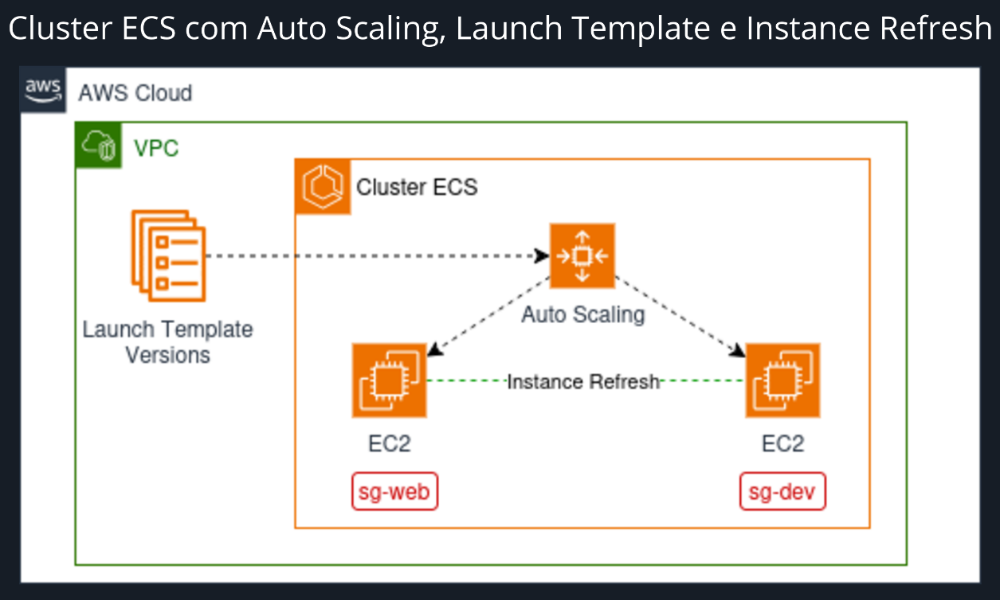
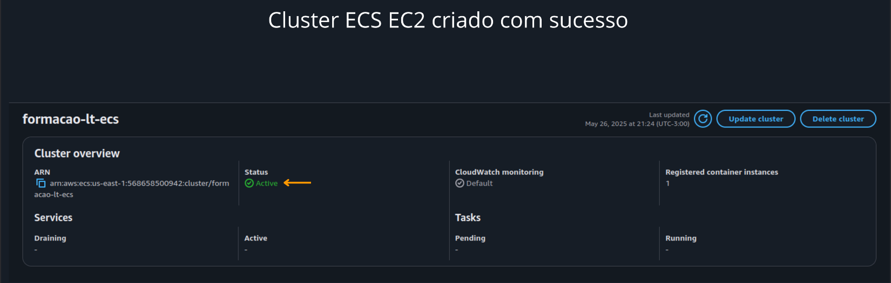
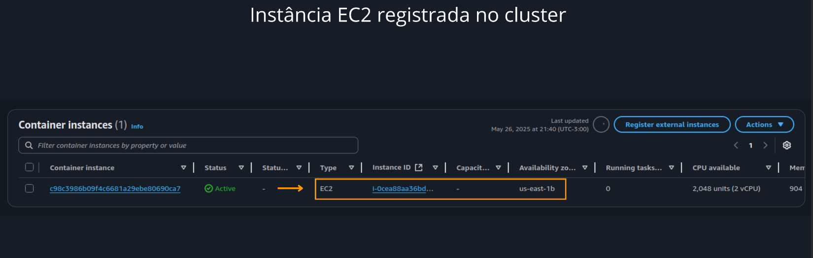
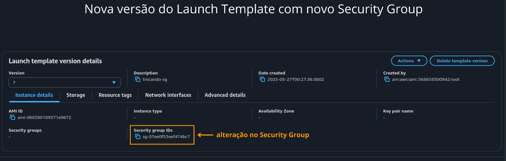
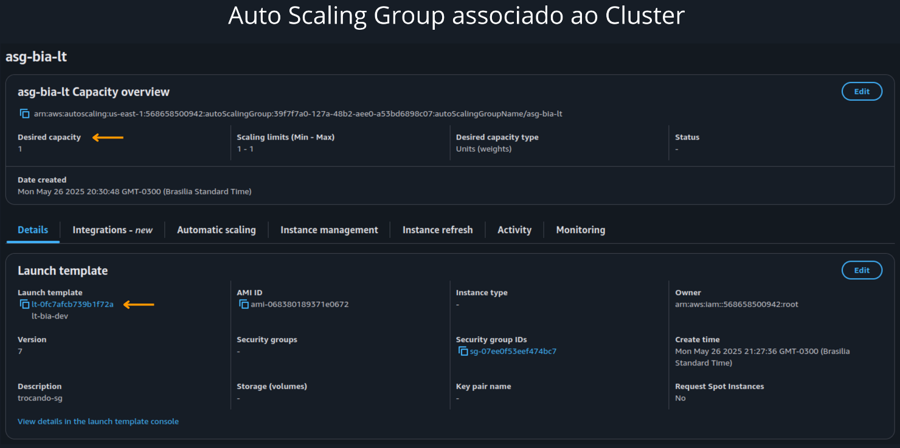
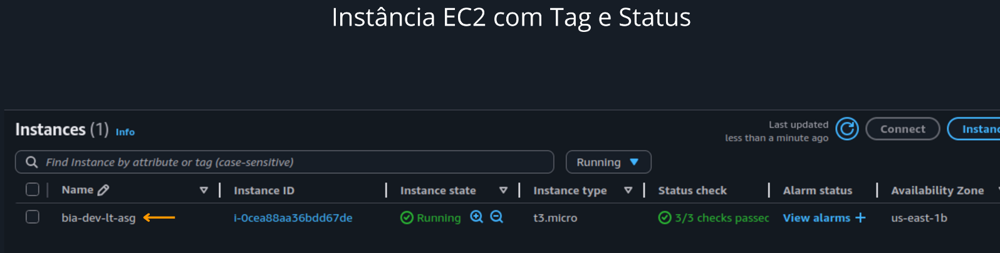
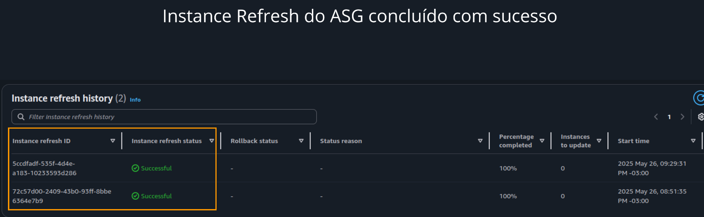

# Gerenciamento de Cluster ECS com Launch Template e Auto Scaling na AWS

Projeto desenvolvido como parte da **Mentoria Desafio Labs 2.0** da Formação AWS promovida por **Henrylle Maia**.  
O objetivo é implementar uma arquitetura baseada em **Amazon ECS (EC2 Launch Type)** com foco em alta disponibilidade, escalabilidade e gerenciamento de atualizações por meio de recursos como **Launch Templates** e **Auto Scaling Groups com Instance Refresh**.

---

## :bookmark_tabs: Sumário

- [Objetivo](#objetivo)
- [Arquitetura](#arquitetura)
- [Componentes Utilizados](#componentes-utilizados)
- [Etapas Realizadas](#etapas-realizadas)
- [Pré-requisitos](#pré-requisitos)
- [Aprendizados](#aprendizados)
- [Capturas de Tela](#capturas-de-tela)
- [Autor](#autor)
- [Licença](#licença)

---

## 🎯 Objetivo

Criar uma solução escalável e segura utilizando ECS (EC2 Launch Type), com instâncias personalizadas via Launch Template e atualizações seguras com Instance Refresh, garantindo disponibilidade contínua do ambiente.

---

## 🧩 Arquitetura

Diagrama representando a arquitetura implementada com os principais serviços da AWS:

---

## 🛠️ Componentes Utilizados

- **Amazon ECS (EC2 Launch Type)**
- **Amazon EC2**
- **Launch Template**
- **Auto Scaling Group**
- **Security Groups**
- **Instance Refresh (ASG)**

---

## 🚀 Etapas Realizadas

1. Criação de um **ECS Cluster com instâncias EC2**
2. Configuração de um **Launch Template** com parâmetros personalizados
3. Lançamento das instâncias via **Auto Scaling Group**
4. Criação de uma **nova versão do Launch Template** com alteração no Security Group
5. Aplicação do **Instance Refresh** para atualização gradual das instâncias

---

## 📌 Pré-requisitos

- Conta ativa na AWS
- Permissões para uso dos serviços EC2, ECS e Auto Scaling
- Conhecimentos básicos em infraestrutura na nuvem

---

## 📚 Aprendizados

- Provisão de clusters ECS com instâncias EC2 gerenciadas
- Personalização de instâncias com Launch Templates
- Uso de versões em templates para atualização segura de configurações
- Aplicação de Instance Refresh para substituição não disruptiva
- Boas práticas de disponibilidade, automação e controle de mudanças

---

## 📸 Capturas de Tela

Abaixo estão registros visuais das principais etapas do projeto e da arquitetura aplicada:

---

### 1. Cluster ECS EC2 criado com sucesso

---

### 2. Associação de EC2 ao Cluster ECS  

---

### 3. Configuração do Launch Template  

---

### 4. Criação e Configuração do Auto Scaling Group  

---

### 5. Instâncias EC2 ativas no ambiente  

---

### 6. Execução do Instance Refresh para Atualização Gradual  

---

## 👤 Autor

Desenvolvido por [**Aryane Andrade**](https://github.com/aryaneandrade)  
Mentoria Desafio Labs 2.0 | Formação AWS – Henrylle Maia

---

## 📄 Licença

Este projeto tem finalidade **educacional** e **não comercial**.  
Distribuído livremente para fins de aprendizado.  
© 2025 Aryane Andrade
